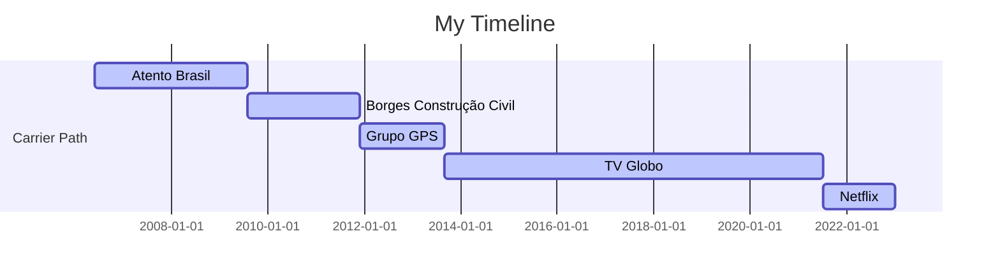

# Hi, I'm Bruno Borges.
Glad you're here. Have fun!

## Profile 

I'm an enthusiast of Data-Driven culture, transforming large amounts of data into relevant information and business insights. For these last thirteen years, I have been closing the gap between Data Analytics, Strategic Planning, Finance, and Management teams.

My main activities involve data analysis, budget forecasting, operational management, project Management, and innovation. I can analyze, model, structure, and interpret data and develop a systemic and analytical perception of indicators and processes.
 
Ability to analyze, model, structure and interpret data and to develop a systemic and analytical perception of indicators and processes.

Technically, I'm fluent in several programming languages and tools like SQL, MS Excel, GS, Python, and R, as well as developing beautiful visualization using Power BI, Tableau, MicroStrategy, and others to deliver data-driven solutions for support and decision-making.
  

 
   

----

## Work experience:

:black_medium_square: Associate Production Finance - Studio Finance - Netflix (Jun 2021 - Current Position)

:black_medium_square: Planning Coordinator - TV Globo – (Feb 2020 – Jun 2021)

:black_medium_square: Executive Travel Supervisor - TV Globo – (Jun 2019 – Feb 2020)

:black_medium_square: Senior Analyst - TV Globo – (Apr 2016 – Jun 2019)

:black_medium_square: Analyst - TV Globo – (Nov 2014 – Apr 2016)

:black_medium_square: Junior Analyst - TV Globo – (Aug 2013 – Nov 2014)

:black_medium_square: Planning Analyst - GPS Group - (Dec 2011 - Aug 2013)

:black_medium_square: Financial Manager - Borges Construção Civil LTDA - (Aug 2009 - Nov 2011)

:black_medium_square: Junior Planning Analyst - Atento S/A – (Aug 2007 – Jul 2009)

:black_medium_square: Planning Assistant - Atento S/A - (Feb 2007 - Aug 2007

:black_medium_square: Telemarketing Operator - Atento S/A - (Sep 2006 - Feb 2007)

## Education

Master of Business Administration - Data Science & Analytics at Universidade de Sao Paulo (USP) - (2021 – 2022, Dec)

Graduated in Systems Development at the Centro Universitário Unicarioca – (2009 – 2013)

## Training

Data Analytics:

:white_square_button: Python

:white_square_button: R Studio

:white_square_button: SQL

:white_square_button: Microsoft Excel and VBA

:white_square_button: Statistics with Python

:white_square_button: Fundamental Statistics

:white_square_button: Machine Learning Models

Data Visualization:

:white_square_button: Business Intelligence and Data Visualization

:white_square_button: Tableau

:white_square_button: MicroStrategy

:white_square_button: Power BI

:white_square_button: Data Visualization with Python and R

Management:

:white_square_button: Project Management

:white_square_button: High-impact presentations Leadership

:white_square_button: Communication Development

:white_square_button: Management to results

:white_square_button: Negotiation and Influence

Languages:

:white_square_button: Portuguese

:white_square_button: English

:white_square_button: Spanish

